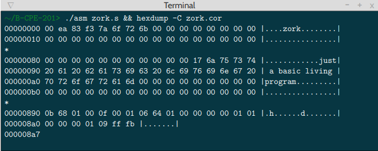

# COREWAR

Ce projet a pour but de vous faire réaliser une "arène" virtuelle dans laquelle vont s’affronter des champions qui vont être des programmes. Nous allons également réaliser un assembleur permettant de compiler ces champions.

Le projet sera réaliser en groupe de quatre, c'est le dèrnier projet de fin d'année de première année d'Epitech.

Le projet sera donc séparer en deux grandes parties la partie assembleur et la partie virtual Machine.


## But du programme

Le but va être de créer un assembleur qui va ensuite transmettre les informations à la VM.

L'assembleur :

Votre machine virtuelle va exécuter du code machine (ou "bytecode"), qui devra être généré par votre assembleur. L’assembleur (le programme) va prendre en entrée un fichier écrit en assembleur (le langage), et sortir un champion qui sera compréhensible par la machine virtuelle.

Il se lance de la façon suivante : ./asm/asm monchampion.s

Il va lire le code assembleur à traiter depuis le fichier .s passé en paramètre, et écrire le bytecode résultant dans un fichier nommé comme l’entrée en remplaçant l’extension .s par .cor .

En cas d’erreur, vous devrez afficher un message pertinent sur la sortie d’erreur, et ne pas produire de fichier .cor

La Virtual machine :	

La machine virtuelle, qui va permettre de comprendre les fichiers binaires envoyés par l'assembleur, de les interprêter et qui va pouvoir les exécuter et abriter le combat entre les champions.


## Fonctions autorisées

```

	• Write 
	• Malloc
	• free
	• Read 
	• Exit
	• getline
	• lseek
	• fseek
	• realloc
```

## Mise en route

Ces instructions vous permettront d'obtenir une copie du projet opérationnel sur votre machine locale à des fins de développement et de test.

### Pré-requis

De quoi avez-vous besoin pour installer le logiciel et comment l'installer ?

```

gcc
make

```

### Installation

Compilation du projet

```
make
```

Lancement du projet

```
./asm/asm fichier.s	
chmod +x zork.cor
hexdump -C fichier.cor
```

## Captures d'écrans

Exemple de lancement et de calcul :



